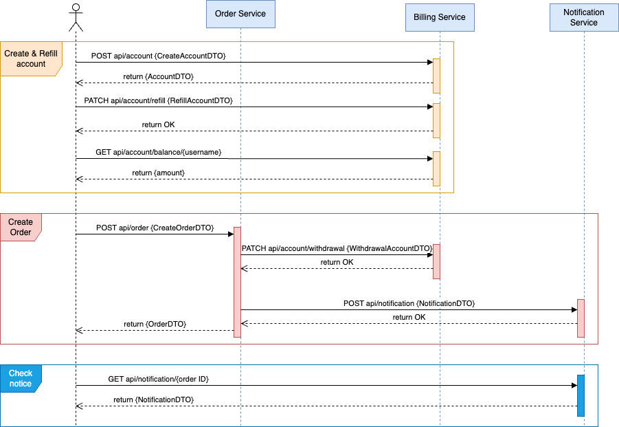
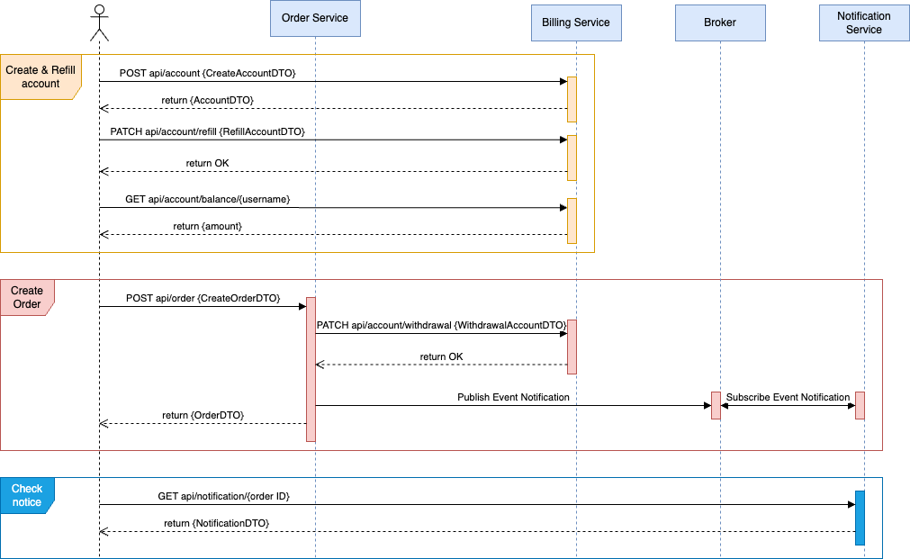
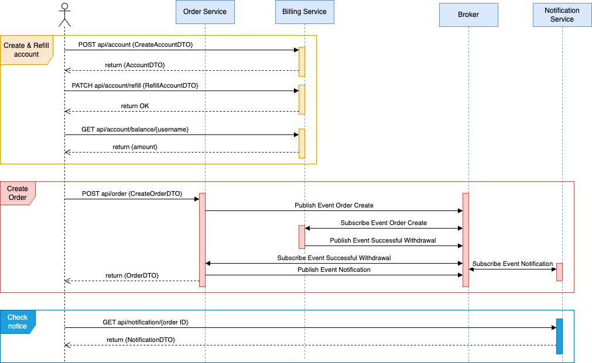

### Архитектурные решения (ТЕОРЕТИЧЕСКАЯ ЧАСТЬ) 

* только HTTP взаимодействие \
  

 

* __реализованное решение:__ событийное взаимодействие с использование брокера сообщений для нотификаций (уведомлений) \
  

 

* Event Collaboration cтиль взаимодействия с использованием брокера сообщений \
  